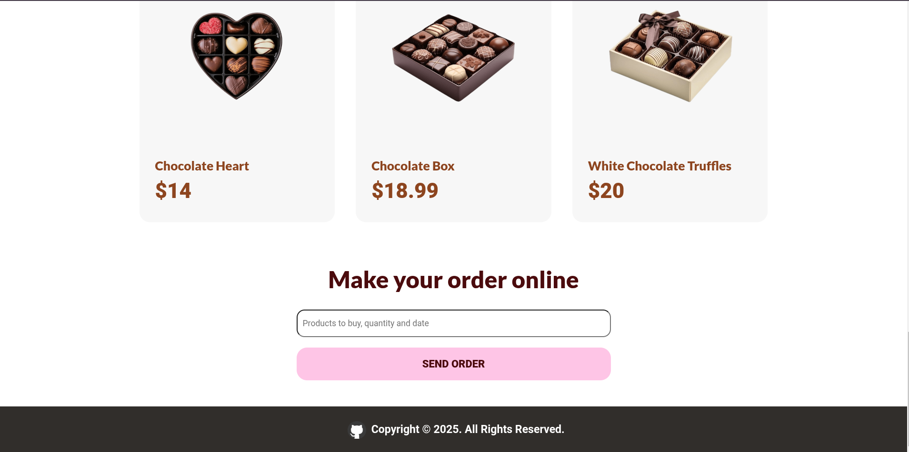

# SweetHeart-Chocolates-HTML-CSS

It's a simple landing page to promote sales for Chocolates's Day on July 7th, and was made in order to practice my HTML and CSS skills.

## Tech Stack

<div style="display: flex; align-items: center;">
  
  
</div>

## Features

- Responsive layout for all devices
- Beautiful images and color's palette

## How to Use

```
git clone https://github.com/A4GOD-AMHG/SweetHeart-Chocolates-HTML-CSS.git
```

- Open index.html in your browser
- Explore the learning features presentation
- (Optional) Modify CSS styles in styles.css

## Screenshots




## Author

- Alexis Manuel Hurtado García (<https://github.com/A4GOD-AMHG>)
